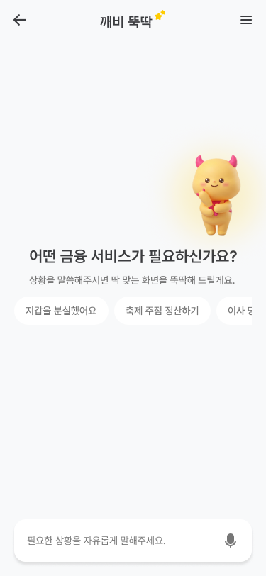
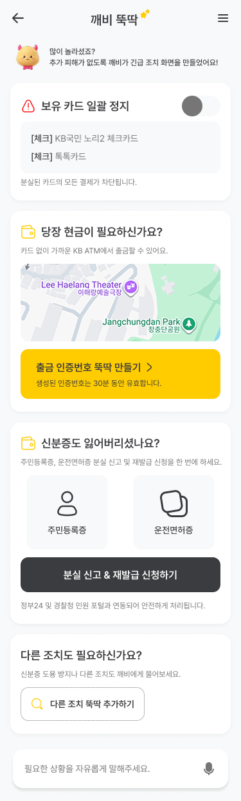
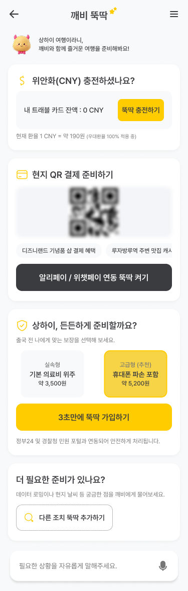
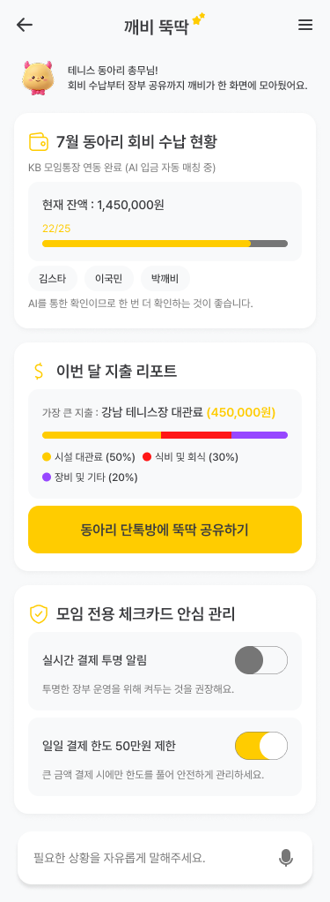
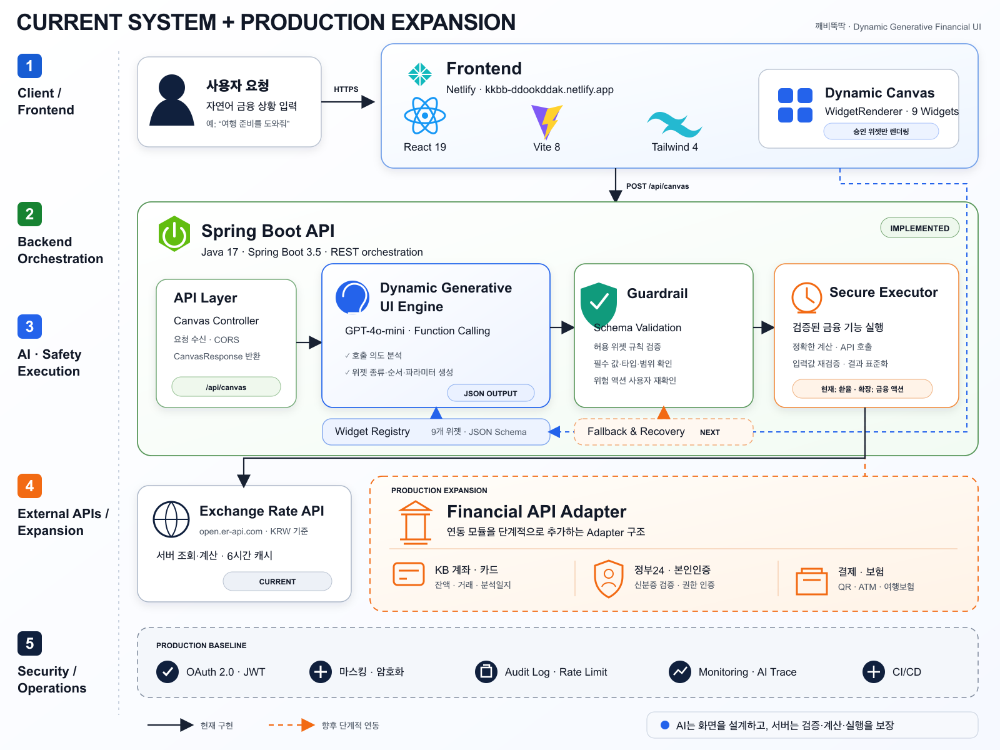

<div align="center">

# 깨비뚝딱 ✨

### 말하면, 필요한 금융 화면이 바로 만들어집니다.

사용자의 자연어를 이해하고 필요한 금융 기능을 실시간으로 조합하는<br />
**동적 생성형 금융 UI 서비스**

[](https://www.figma.com/design/hW2FEx2HREkWZSIQR4qJqf/2026-KB-AI-Challenge)
[](https://kkbb-ddookddak.netlify.app)

<br />



<br />

**[깨비뚝딱 바로 체험하기 →](https://kkbb-ddookddak.netlify.app)**

</div>

---

## 서비스 소개

금융 앱에서 필요한 기능을 찾기 위해 여러 메뉴를 탐색하는 대신, 사용자가 자신의 상황을 말하면 깨비뚝딱이 의도를 분석합니다. 분석 결과에 따라 승인된 금융 위젯의 **종류·순서·데이터**를 동적으로 조합해 한 화면에 제공합니다.

> 깨비뚝딱은 정해진 화면 하나를 추천하는 서비스가 아닙니다. 생성형 AI가 사용자의 복합적인 상황을 해석해 필요한 금융 기능을 실시간으로 구성하는 **Generative UI** 서비스입니다.

### 핵심 사용자 흐름

```text
자연어 입력
  → AI 복합 의도 분석
  → 금융 위젯 선택 및 파라미터 추출
  → 서버 검증과 실제 데이터 결합
  → 사용자 맞춤 화면 렌더링
```

## 3가지 대표 시나리오

<table>
  <tr>
    <th width="33%">🚨 지갑 분실</th>
    <th width="33%">✈️ 해외여행 준비</th>
    <th width="33%">👥 동아리 회비 관리</th>
  </tr>
  <tr>
    <td align="center"></td>
    <td align="center"></td>
    <td align="center"></td>
  </tr>
  <tr>
    <td>카드 일괄 정지, 카드 없는 스마트 ATM 출금, 신분증 분실 신고·재발급을 한 화면에 구성합니다.</td>
    <td>여행지 통화 충전, 현지 QR 결제, 여행 기간에 맞는 보험 위젯을 함께 구성합니다.</td>
    <td>회비 수납 현황, 지출 리포트, 모임카드 안전 설정을 총무용 화면으로 구성합니다.</td>
  </tr>
</table>

## 이렇게 입력해 보세요

[배포 서비스](https://kkbb-ddookddak.netlify.app)에 접속한 뒤 아래 문장을 입력하고 전송하면 됩니다. 표현을 조금 바꿔도 AI가 목적과 필요한 정보를 분석합니다.

### 1. 지갑 분실 긴급 대응

```text
지갑을 잃어버렸어. 카드 정지하고 현금 찾는 방법이랑 신분증 재발급도 알려줘.
```

생성 위젯: `card_freeze_all` · `atm_smart_withdrawal` · `id_reissue_status_widget`

### 2. 해외여행 준비

```text
상하이로 3박 4일 여행 가는데 환전, QR 결제, 여행자보험 준비해줘.
```

생성 위젯: `travel_card_charge_widget` · `overseas_qr_payment_widget` · `travel_insurance_widget`

여행지, 통화 코드, 여행 일수, 요청 금액을 함께 추출하며 실제 환율은 서버가 별도 API로 조회합니다.

### 3. 동아리 회비 관리

```text
테니스 동아리 총무야. 이번 달 회비 수납 현황이랑 지출 리포트, 카드 안전 설정 보여줘.
```

생성 위젯: `group_account_status` · `expense_report_widget` · `group_card_safety_widget`

## 시스템 아키텍처

<p align="center">
  
</p>

AI는 **어떤 화면이 필요한지** 생성하고, 서버는 **정확한 데이터와 실행 가능성**을 보장합니다.

- **Dynamic UI Engine**: 복합 의도를 분석해 위젯 종류·순서·파라미터를 JSON으로 생성
- **Widget Registry & Guardrail**: 승인된 9개 위젯과 JSON Schema를 기준으로 필수 값·타입·범위를 검증
- **Secure Executor**: AI가 아닌 서버가 환율·수수료 계산, 입력값 재검증, 외부 API 호출과 결과 표준화를 담당
- **Fallback & Recovery**: JSON 파싱 실패, 미지원 요청, 외부 API 장애 시 재시도 또는 안전한 기본 화면으로 복구
- **Financial API Adapter**: 현재 환율 API에서 KB 계좌·카드, 본인인증, 공공기관, 결제·보험 API로 단계적 확장
- **Security & Operations**: OAuth 2.0, 개인정보 마스킹, 암호화, 감사 로그, Rate Limit, AI Trace와 CI/CD 적용
- **Human Confirmation**: 송금·결제·카드 정지 등 실제 금융 거래는 사용자 최종 확인 후 실행

## 기술적 특징

### 제한형 Generative UI

AI가 임의의 React 코드를 생성해 실행하지 않습니다. `Function Calling`의 enum과 JSON 스키마를 이용해 **승인된 9개 위젯 안에서만** 화면을 구성합니다. 이를 통해 생성형 AI의 유연성을 유지하면서도 예측 가능한 렌더링과 검증이 가능합니다.

### 금융 데이터와 AI 판단 분리

AI는 여행지에서 사용할 통화 코드와 필요한 기능을 판단하지만 실제 환율을 생성하지 않습니다. 환율과 계산 값은 Spring Boot 서버가 `open.er-api.com`에서 조회하며, 6시간 동안 인메모리 캐시합니다.

### 위젯 기반 확장

새로운 금융 시나리오는 페이지 전체를 다시 개발하는 대신 다음 두 요소를 추가해 확장할 수 있습니다.

1. 프론트엔드 위젯 컴포넌트
2. 백엔드 위젯 스키마 및 데이터 빌더

향후 KB 계좌·카드, 본인인증, 공공기관, 보험·결제 API도 어댑터 방식으로 연결할 수 있습니다.

## Tech Stack

| 영역 | 기술 |
| --- | --- |
| Frontend | React 19, React Router 7, Vite 8 |
| Styling | Tailwind CSS 4, Iconify |
| Backend | Java 17, Spring Boot 3.5, Maven |
| Generative AI | OpenAI `gpt-4o-mini`, Function Calling |
| External Data | Exchange Rate API (`open.er-api.com`) |
| Deployment | Netlify |
| Design | Figma |

## Widget Catalog

| 시나리오 | 위젯 타입 | 역할 |
| --- | --- | --- |
| 해외여행 | `travel_card_charge_widget` | 여행지 통화 충전 및 예상 원화 계산 |
| 해외여행 | `overseas_qr_payment_widget` | 현지 QR 결제 연결 |
| 해외여행 | `travel_insurance_widget` | 여행 기간 기반 보험 플랜 안내 |
| 동아리 | `group_account_status` | 회비 수납 및 미납 현황 |
| 동아리 | `expense_report_widget` | 월별 지출 분석 및 공유 |
| 동아리 | `group_card_safety_widget` | 결제 알림과 일일 한도 관리 |
| 긴급 | `card_freeze_all` | 보유 카드 일괄 정지 화면 |
| 긴급 | `atm_smart_withdrawal` | 카드 없는 ATM 출금 안내 |
| 긴급 | `id_reissue_status_widget` | 신분증 신고·재발급 절차 안내 |

## 로컬 실행

### 1. Backend 실행

백엔드 저장소를 내려받아 OpenAI API 키를 설정합니다.

```bash
git clone https://github.com/sunwoo030616/KKBB-ddook-ddak-back.git
cd KKBB-ddook-ddak-back
export OPENAI_API_KEY="your-openai-api-key"
./mvnw spring-boot:run
```

백엔드는 기본적으로 `http://localhost:8080`에서 실행됩니다.

### 2. Frontend 실행

```bash
git clone https://github.com/seonwoochoi24/kkbb-ddook-ddak-front.git
cd kkbb-ddook-ddak-front
npm install
```

프로젝트 루트에 `.env.local`을 생성합니다.

```env
VITE_CHAT_API_URL=http://localhost:8080/api/canvas
```

개발 서버를 실행합니다.

```bash
npm run dev
```

브라우저에서 `http://localhost:5173`으로 접속합니다.

## API 사용 예시

```bash
curl -X POST http://localhost:8080/api/canvas \
  -H "Content-Type: application/json" \
  -d '{"message":"상하이로 3박 4일 여행 가는데 준비해줘"}'
```

응답 예시:

```json
{
  "greeting": "상하이 여행이라니, 깨비와 함께 즐거운 여행을 준비해봐요!",
  "widgets": [
    {
      "type": "travel_card_charge_widget",
      "currency": "CNY",
      "supported": true
    }
  ]
}
```

## 현재 구현 범위와 확장 계획

### 구현 완료

- 자연어 입력 → AI 의도 분석 → 위젯 조합 → 동적 화면 렌더링
- 3개 금융 시나리오와 9개 승인 위젯
- 여행지·통화·금액·모임명·여행 기간 구조화 추출
- 실시간 환율 조회와 6시간 캐시
- OpenAI 오류 시 빈 위젯 응답으로 안전한 폴백

### 향후 확장

- KB 계좌·카드 API 및 본인인증
- 정부24·경찰청 등 공공기관 API
- 실제 QR 결제, ATM, 보험 가입 연동
- 사용자별 권한 검증, 감사 로그, 개인정보 암호화
- AI 응답 품질 및 서비스 장애 모니터링

## Repository

- Frontend: [seonwoochoi24/kkbb-ddook-ddak-front](https://github.com/seonwoochoi24/kkbb-ddook-ddak-front)
- Backend: [sunwoo030616/KKBB-ddook-ddak-back](https://github.com/sunwoo030616/KKBB-ddook-ddak-back)
- Design: [2026 KB AI Challenge Figma](https://www.figma.com/design/hW2FEx2HREkWZSIQR4qJqf/2026-KB-AI-Challenge)
- Live Demo: [kkbb-ddookddak.netlify.app](https://kkbb-ddookddak.netlify.app)

---

<div align="center">
  <strong>필요한 금융 기능을 찾지 말고, 상황을 말해보세요. 깨비가 화면을 뚝딱 만들어드립니다.</strong>
</div>
